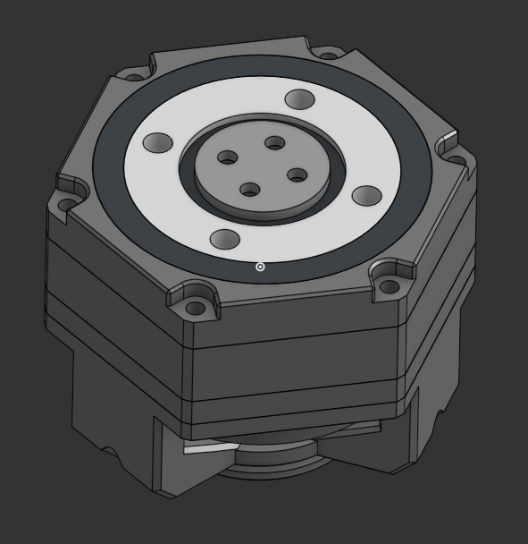
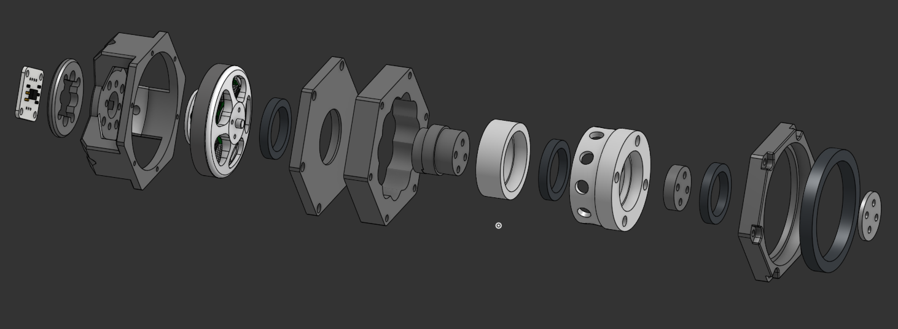

# Actuator V1 Specification
---

## Ball-Element Cycloidal drive actuator V1
- bldc motor : 5010 bldc motor : [5010 bldc motor](https://ko.aliexpress.com/item/32479766898.html?spm=a2g0o.productlist.main.1.33057c53lJVQHb&algo_pvid=e840ea96-f714-4eec-8270-79e061d0168f&algo_exp_id=e840ea96-f714-4eec-8270-79e061d0168f-0&pdp_npi=4%40dis%21KRW%2123333%2118200%21%21%2115.77%2112.30%21%402151e6dc17377385292943241e47af%2157785798523%21sea%21KR%212150707868%21X&curPageLogUid=j8mT7lyyXHrL&utparam-url=scene%3Asearch%7Cquery_from%3A)
- motor driver : simplefoc v2 : [simplefoc v2](https://simplefoc.com/simplefoc_shield_product)
- microcontroller : arduino uno
- encoder : AS5600 : [AS5600](https://ko.aliexpress.com/item/1005006502384626.html?spm=a2g0o.productlist.main.1.3b184509pllIzN&algo_pvid=5b9a62a0-d0b4-4c4f-8faf-10328b964263&algo_exp_id=5b9a62a0-d0b4-4c4f-8faf-10328b964263-0&pdp_npi=4%40dis%21KRW%211539%211523%21%21%211.04%211.03%21%402151e6dc17377383531286763e4796%2112000037438363873%21sea%21KR%212150707868%21X&curPageLogUid=Tml9fqmeUygT&utparam-url=scene%3Asearch%7Cquery_from%3A)
- For CAN BUS : None
- gear box : 3d printed gearbox

you can see more specific code at [simplefoc documents](https://docs.simplefoc.com/code)
