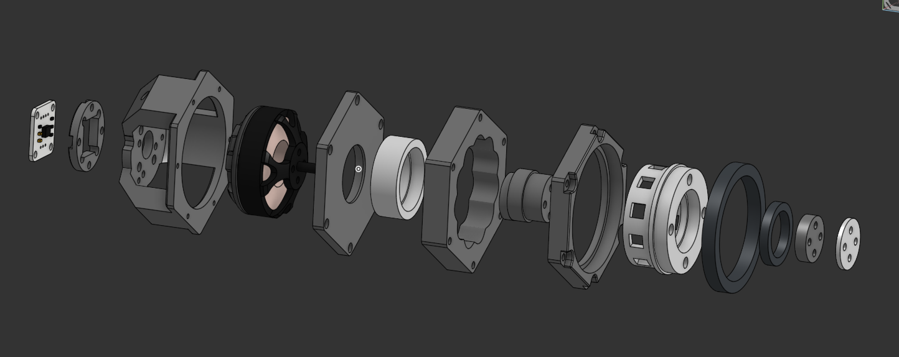
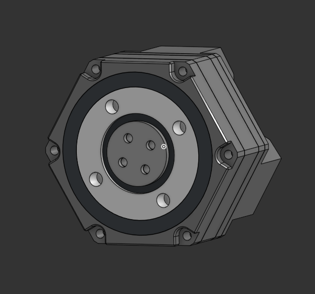
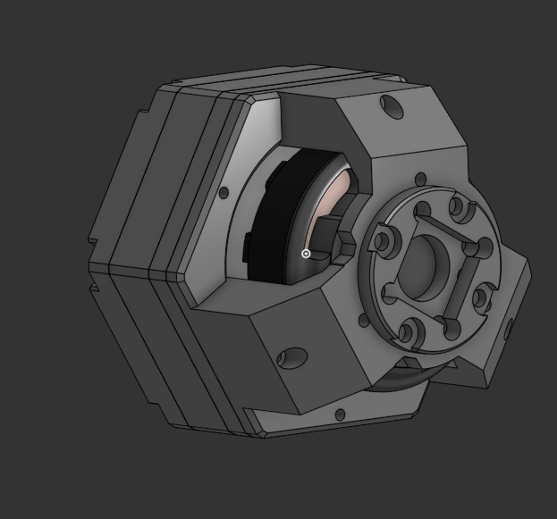

# Proprioceptive Actuator V2 Specification
---

## Ball-Element Cycloidal drive actuator V2 (High Performance)
- bldc motor : Gartt ML5210 bldc motor(1EA): [sunnysky x4108s-17 bldc motor](https://ko.aliexpress.com/item/4001297326582.html?spm=a2g0o.order_list.order_list_main.9.21ef140fx0qOKv&gatewayAdapt=glo2kor)
- motor driver : drv8302(1EA) : [drv8302 driver](https://ko.aliexpress.com/item/4000126430773.html?spm=a2g0o.order_list.order_list_main.14.2718140fpj8eC3&gatewayAdapt=glo2kor)
- microcontroller : ESP-wroom-32(1EA) : [ESP-wroom-32](https://ko.aliexpress.com/item/1005007050459447.html?spm=a2g0o.order_list.order_list_main.46.846e140fXxRS15&gatewayAdapt=glo2kor)
- encoder : AS5600(1EA) : [AS5600](https://ko.aliexpress.com/item/1005006502384626.html?spm=a2g0o.productlist.main.1.3b184509pllIzN&algo_pvid=5b9a62a0-d0b4-4c4f-8faf-10328b964263&algo_exp_id=5b9a62a0-d0b4-4c4f-8faf-10328b964263-0&pdp_npi=4%40dis%21KRW%211539%211523%21%21%211.04%211.03%21%402151e6dc17377383531286763e4796%2112000037438363873%21sea%21KR%212150707868%21X&curPageLogUid=Tml9fqmeUygT&utparam-url=scene%3Asearch%7Cquery_from%3A)
- For CAN BUS : TJA1051T(1EA) : [TJA1051T](https://ko.aliexpress.com/item/1005007053249619.html?spm=a2g0o.order_list.order_list_main.4.7785140fjxlg5H&gatewayAdapt=glo2kor)
- gear box : 3d printed gearbox
- ball-elements(10EA) : [M6x6mm ball-elements](https://ko.aliexpress.com/item/1005003729421711.html?spm=a2g0o.order_list.order_list_main.138.846e140fXxRS15&gatewayAdapt=glo2kor)
- M3x30mm bolts(4EA) : [M3x30mm bolts](https://ko.aliexpress.com/item/1005005879037174.html?spm=a2g0o.order_list.order_list_main.111.846e140fXxRS15&gatewayAdapt=glo2kor)
- M3x20mm bolts(6EA) : [M3x20mm bolts](https://ko.aliexpress.com/item/1005005879037174.html?spm=a2g0o.order_list.order_list_main.22.846e140fXxRS15&gatewayAdapt=glo2kor)
- M2x10mm bolts(6EA) : [M2x10mm bolts]()
- M2x3mm insert nuts(6EA) : [M2x3mm insert nuts](https://ko.aliexpress.com/item/1005004870993068.html?spm=a2g0o.order_list.order_list_main.16.4d25140fb34rFV&gatewayAdapt=glo2kor)
- M3x3mm insert nuts(6EA) : [M3x3mm insert nuts](https://ko.aliexpress.com/item/1005004870993068.html?spm=a2g0o.order_list.order_list_main.16.4d25140fb34rFV&gatewayAdapt=glo2kor)
- M3x6mm insert nuts(6EA) : [M3x6mm insert nuts](https://ko.aliexpress.com/item/1005004870993068.html?spm=a2g0o.order_list.order_list_main.16.4d25140fb34rFV&gatewayAdapt=glo2kor)
- 20x27x4 bearings(3EA) : [20x27x4 bearings](https://ko.aliexpress.com/item/1005006822777675.html?spm=a2g0o.productlist.main.1.76e86515Q34gQr&algo_pvid=fe067309-f121-42a0-a594-e87d0db4a0e0&algo_exp_id=fe067309-f121-42a0-a594-e87d0db4a0e0-0&pdp_ext_f=%7B%22order%22%3A%2275%22%2C%22eval%22%3A%221%22%7D&pdp_npi=4%40dis%21KRW%2110959%217020%21%21%2152.98%2133.94%21%4021010d9017417720432307776e2ec5%2112000038590813947%21sea%21KR%212150707868%21X&curPageLogUid=KbQ3xlLuoznH&utparam-url=scene%3Asearch%7Cquery_from%3A)
- 45x55x6mm bearings(1EA) : [45x55x6mm bearings](https://ko.aliexpress.com/item/4000909605390.html?spm=a2g0o.productlist.main.45.7cb8pQAvpQAvH8&algo_pvid=80661dd4-c983-4595-9eb3-adbbb459767f&algo_exp_id=80661dd4-c983-4595-9eb3-adbbb459767f-22&pdp_ext_f=%7B%22order%22%3A%22427%22%2C%22eval%22%3A%221%22%7D&pdp_npi=4%40dis%21KRW%2142339%2126250%21%21%2128.33%2117.56%21%40213ba0c517417720132146408e66d0%2112000028447926047%21sea%21KR%212150707868%21X&curPageLogUid=AYkLjro41rKe&utparam-url=scene%3Asearch%7Cquery_from%3A)

you can see more specific code at [simplefoc documents](https://docs.simplefoc.com/code)
