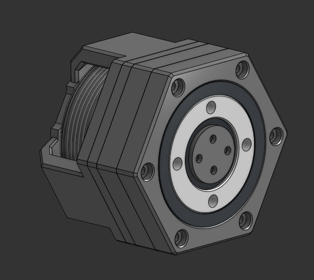

# motor_control

## This repository for motor control and Actuators 
foc control, simplefoc, position control, impedance control and so on

Actuator_V2 folder is complete opensource for proprioceptive actuator. there's a source code for motor control, step files, elements for complete building.

And I am going to make some youtube video for Building Tutorials and specific sources about my own proprioceptive acutator. you can expect it!

Actuator V2 preview is below

